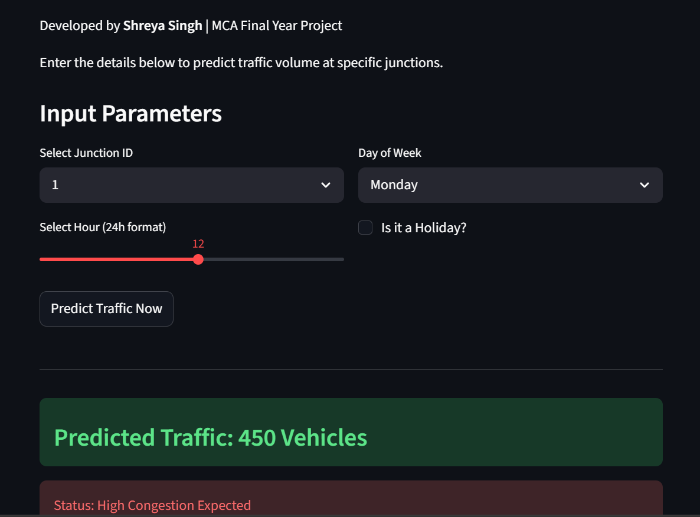
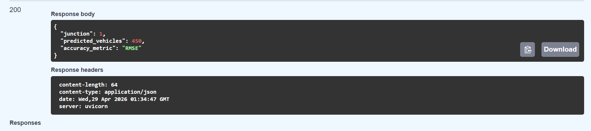

# AI Vehicle Traffic Prediction API 🚦

A FastAPI-based Machine Learning API that predicts traffic congestion levels based on junction, time, and day inputs.

## 🚀 Features
- Predicts traffic volume using ML model
- Returns congestion level: High / Medium / Low
- Built with FastAPI for high performance
- Easy to test with automatic Swagger UI docs

## 🛠️ Tech Stack
- **Backend:** Python, FastAPI
- **Frontend:** Streamlit
- **ML:** Pandas, Scikit-learn
- **Server:** Uvicorn

## 📸 Demo

### 1. FastAPI Response


### 2. Streamlit Web App UI  


## 📍 How to Run Locally

1. **Clone the repo**
```bash
git clone https://github.com/kshatriyashreya219/AI-Vehicle-Traffic-Prediction-FastAPI-.git
cd AI-Vehicle-Traffic-Prediction-FastAPI-pip install -r requirements.txtuvicorn main:app --reload
# AI Vehicle Traffic Prediction API 🚦

FastAPI + ML based API to predict traffic congestion.

## Run Locally
Test: `http://127.0.0.1:8000/docs`

**Made by Shreya** | MCA Student
